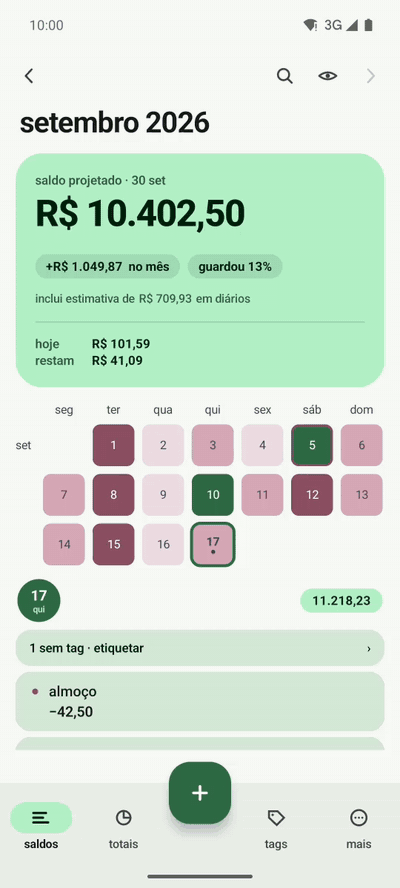
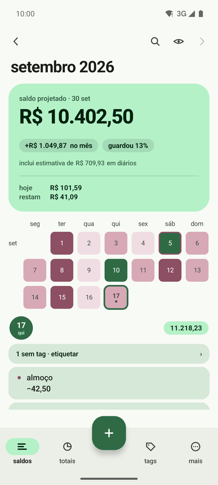
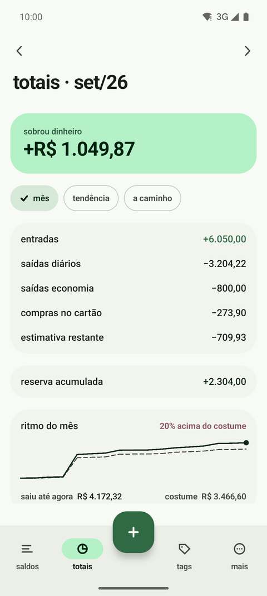
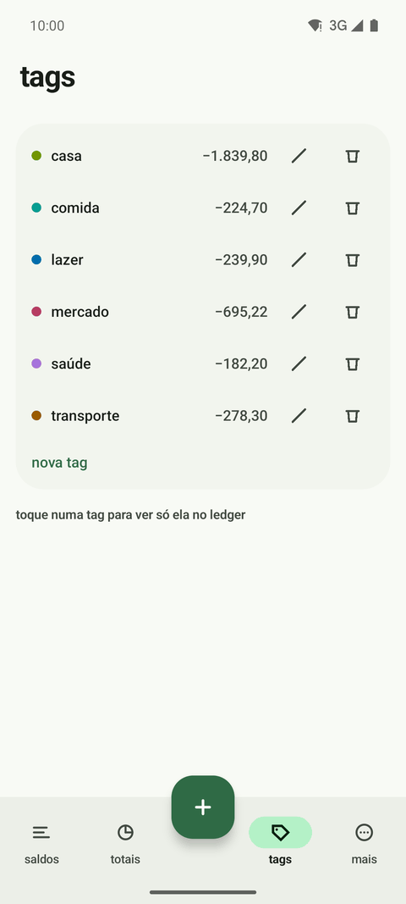
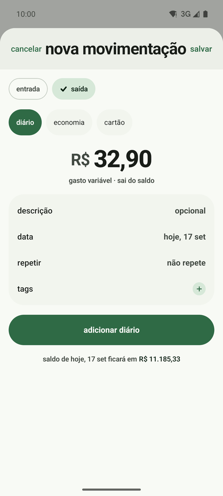
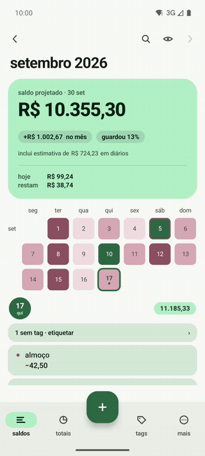

# saldo

um app 100% local para controle dos seus próprios gastos.

Todo app de finanças, pago ou não, esbarra no mesmo problema: depende de você lembrar de
lançar cada gasto. O saldo lê o valor nas notificações do seu banco e sugere o lançamento —
você só confirma. Depois disso, é categorizar.

Nada sai do aparelho: sem conta, sem nuvem, sem rede.

## o banco avisa, você confirma

  

O aviso chega, o saldo lê o valor e pergunta. Um toque em **lançar** e o gasto entra no dia de
hoje, com o estabelecimento no lugar da descrição — e vai para a fila do "sem tag", esperando
a categoria. No vídeo o aviso vem por SMS, que é o que um emulador sabe mandar; no aparelho é
o app do banco que você marcou.

## as telas

| saldos | totais | tags | lançar |
| :---: | :---: | :---: | :---: |
|  |  |  |  |
| um quadradinho por dia, colorido pelo saldo | o que entrou, o que saiu e o ritmo | para onde o dinheiro foi | o valor primeiro; o resto é opcional |

## dando uma volta

  

Um gasto pelo teclado de uma mão só, o mês fechando, a tendência dos últimos seis meses e as
tags.

## como rodar

Ferramentas via [mise](https://mise.jdx.dev): `mise install` instala JDK, Gradle e Android SDK.

- `mise run sdk-setup` — pacotes do Android SDK (uma vez)
- `mise run build` — APK debug em `app/build/outputs/apk/debug/`
- `mise run test` — testes unitários
- `mise run test-device` — testes instrumentados (precisa de um device ou emulador ligado)
- `mise run install` — instala num device conectado
- `mise run demo-seed` — enche o device com quatro meses de dados falsos, que é de onde saem
  as imagens daqui. Apaga o que estiver lá: use num emulador, nunca no seu aparelho.

## o que tem

- **lançar** — o `+` cobra só o valor; descrição, tag e recorrência são opcionais.
- **notificações** — `mais → notificações`: marque os apps do banco e o saldo sugere lançar cada valor que chegar. Desligado por padrão; nenhum texto de notificação vai para o disco.
- **saldos** — o mês em quadradinhos, um por dia, colorido pelo saldo do dia. Toque num dia para ver os lançamentos dele; busca pela lupa.
- **totais** — o mês, a tendência e o que ainda vem.
- **tags** — categorize e veja para onde foi.
- **widgets e lembretes** — opcionais, desligados por padrão.
- **seus dados** — exportar (csv ou json), restaurar o json de volta, backup automático
  numa pasta que você escolhe, e apagar tudo. Se essa pasta for sincronizada pelo
  aparelho, o histórico sobrevive a ele — e o app continua sem tocar na rede.
